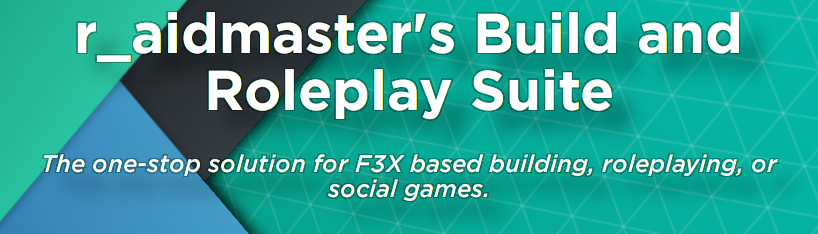

# RBRS - r_aidmaster's Roleplay and Build Suite

--- INDEV ---

r_aidmaster's Roleplay and Build Suite is an open-source UI and F3X modification framework that provides a multitude of features that range from essential to convenient for games that are based around building and/or roleplaying.

More information about the project can be found at:
https://devforum.roblox.com/t/raidroleplay-a-multi-purpose-system-designed-for-f3x-based-building-games/631103

# Other external links:

https://trello.com/b/jc3jXuiw/rbrs-raidroleplay

https://discord.gg/K2GKHbUgaf

# Release links:
-WIP-

# Building and Contributing:

DEVELOPERS:
To work with the RBRS source, either insert a fresh model into your game, or use the provided RemodelRBXMXToDirectory.lua file with the Remodel utility to create a directory to work in with a RBXMX file from Roblox Studio. You can also use the provided RemodelDirectoryToRBXMX.lua utility to convert your local directory to an RBXMX for usage ingame and in Studio.

Remodel can be found at:
https://github.com/rojo-rbx/remodel
